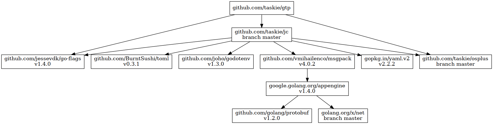

# gtp

macro processor powered by Go (text|html)/template

## Install

```sh
go install github.com/taskie/gtp/cmd/gtp
```

## Usage

```sh
gtp -t hello.tmpl <john.json >john.txt
```

### Template (hello.tmpl)

```
Hello, {{.user.name}}!
```

### Input (john.json)

```json
{"user": {"name": "John"}}
```

### Output (john.txt)

```
Hello, John!
```

## Dependency




## License

Apache License 2.0
